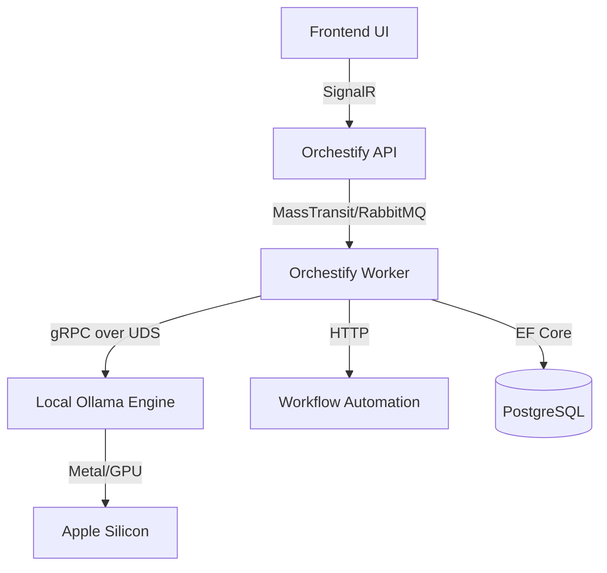

# Orchestify 🚀

[](https://github.com/atakanatali/orchestify/actions/workflows/ci.yml)
[](https://github.com/atakanatali/orchestify/actions/workflows/tests.yml)

**Orchestify** is an AI-powered code orchestration platform designed for high-performance automated development workflows. It runs locally, respects your privacy, and leverages Apple Silicon (Metal/GPU) for near-instant AI responses.

---

## ⚡ Quick Start

Get the entire stack (API, Worker, Postgres, Redis, n8n, Ollama) up and running with a single command:

```bash
chmod +x scripts/up.sh
./scripts/up.sh
```

This script will:
1. Verify host resources (RAM/VRAM check).
2. Start the unified Docker stack.
3. Automatically apply database migrations.
4. Pull the required LLM models (Qwen 2.5 & DeepSeek).

---

## 🏗️ Core Architecture

Orchestify follows Clean Architecture principles with a focus on low-latency inter-process communication.



---

## 🛠️ Configuration

The system is configured via environment variables and `.env` files.

### AI Configuration (`.env.llm`)
| Variable | Description | Default |
|----------|-------------|---------|
| `ACTIVE_MODEL` | Primary model for tasks | `qwen2.5-coder:7b-instruct-q4_K_M` |
| `WARM_MODELS` | Models to keep in memory | `deepseek-coder-v2:16b-lite-instruct-q4_K_M` |
| `RAM_LIMIT_GB` | Hardware RAM limit | `16` |
| `STRICT_RAM_CHECK`| Fail-fast on low RAM | `true` |

### Infrastructure (`docker-compose.yml`)
- **API**: [http://localhost:5000](http://localhost:5000)
- **n8n**: [http://localhost:5678](http://localhost:5678)
- **Ollama**: [http://localhost:11434](http://localhost:11434)
- **Postgres**: `localhost:5432` (User: `orchestify`, DB: `orchestify`)

---

## 🔌 API Endpoints

### 🧠 AI & Orchestration
- `POST /api/tasks/{id}/run` - Executes an AI-driven workflow.
- `GET /api/attempts/{id}/stream` - Real-time thought process and terminal output stream.
- **SignalR Hub**: `AgentThought`, `AgentTerminalAction`, `AgentMetrics`.

###  Git & Workspace
- `POST /api/workspaces/{id}/git/pull` - Sync code.
- `POST /api/workspaces/{id}/build` - Compile project.
- `POST /api/workspaces/{id}/build/test` - Run test suite.

---

## 🍎 Apple Silicon Optimization

Orchestify is optimized for macOS:
- **Metal/GPU Acceleration**: Ollama automatically detects and uses the neural engine.
- **UDS (Unix Domain Sockets)**: High-speed local communication bypassing the network stack.
- **Memory Protection**: Fail-fast logic prevents system freezes by checking available RAM before loading massive models.

---

## License
MIT