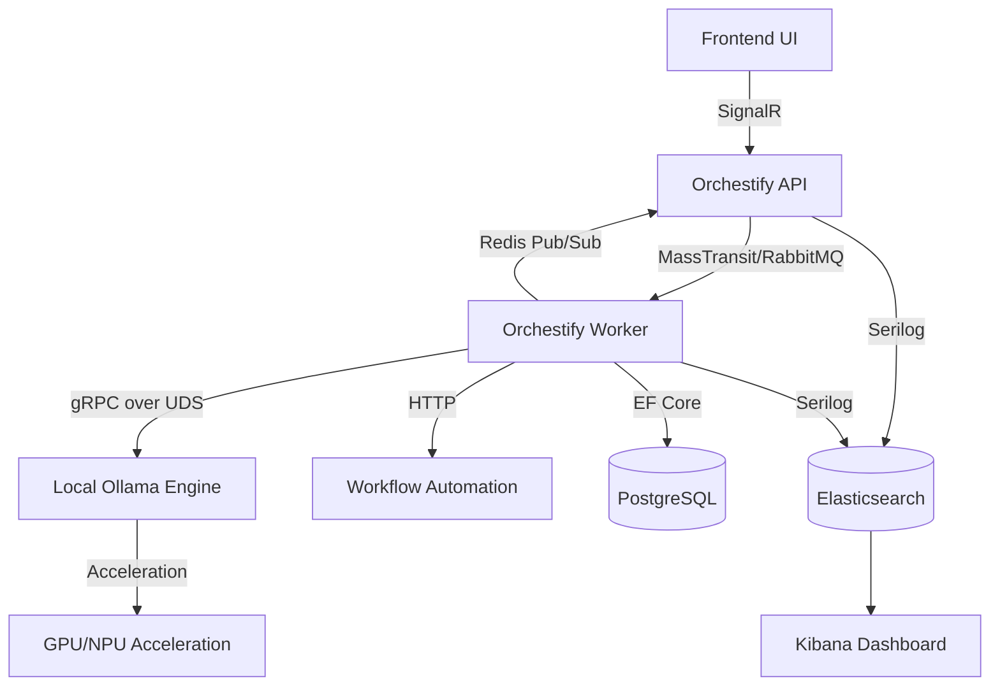

# Orchestify 🚀

[](https://github.com/atakanatali/orchestify/actions/workflows/ci.yml)
[](https://github.com/atakanatali/orchestify/actions/workflows/tests.yml)


**Orchestify** is an AI-powered code orchestration platform designed for high-performance automated development workflows. It runs locally via Docker, respects your privacy, and leverages hardware acceleration (Metal/GPU) for near-instant AI responses across macOS, Linux, and Windows (WSL2).

---

## ⚡ Quick Start

Get the entire stack (Web UI, API, Worker, Postgres, Redis, n8n, Ollama) up and running with a single command:

```bash
chmod +x scripts/up.sh
./scripts/up.sh
```

This script will:
1. Verify host resources (RAM/VRAM check).
2. Start the unified Docker stack.
3. Automatically apply database migrations.
4. Pull and prepare the required LLM models (Qwen 2.5 & DeepSeek).

---

## 🏗️ Core Architecture

Orchestify follows Clean Architecture principles with a focus on low-latency inter-process communication and full observability.



---

## 🛠️ Configuration

The system is configured via environment variables and `.env` files.

### AI Configuration (`.env.llm`)
| Variable | Description | Default |
|----------|-------------|---------|
| `ACTIVE_MODEL` | Primary model for tasks | `qwen2.5-coder:7b-instruct-q4_K_M` |
| `WARM_MODELS` | Models to keep in memory | `deepseek-coder-v2:16b-lite-instruct-q4_K_M` |
| `RAM_LIMIT_GB` | Hardware RAM limit | `16` |
| `STRICT_RAM_CHECK`| Fail-fast on low RAM | `true` |

### Infrastructure
| Service | URL |
|---------|-----|
| **Web UI** | [http://localhost:3000](http://localhost:3000) |
| **API** | [http://localhost:5001](http://localhost:5001) |
| **Kibana** | [http://localhost:5601](http://localhost:5601) |
| **Elasticsearch** | [http://localhost:9200](http://localhost:9200) |
| **RabbitMQ Admin** | [http://localhost:15672](http://localhost:15672) (user: `orchestify`) |
| **n8n** | [http://localhost:5678](http://localhost:5678) |
| **Ollama** | [http://localhost:11434](http://localhost:11434) |
| **Postgres** | `localhost:5432` (User: `orchestify`, DB: `orchestify`) |
| **Redis** | `localhost:6379` |

---

## 🔌 API Endpoints

### 🧠 AI & Orchestration
- `POST /api/tasks/{id}/run` - Executes an AI-driven workflow.
- `GET /api/attempts/{id}/stream` - Real-time thought process and terminal output stream.
- **SignalR Hub**: `AgentThought`, `AgentTerminalAction`, `AgentMetrics`.

### 📂 Workspaces & Git
- `GET /api/workspaces` - List workspaces.
- `POST /api/workspaces/discovery` - Automatically find projects in your local directory.
- `POST /api/workspaces/{id}/git/pull` - Sync code.
- `POST /api/workspaces/{id}/build` - Compile project and run tests.

## ⚡ Hardware Acceleration & Optimization

Orchestify is designed to be cross-platform while squeezing maximum performance from your hardware:

- **Apple Silicon (macOS)**: Automatically leverages the Neural Engine and Metal GPU via Ollama for extreme tokens-per-second.
- **Linux/Windows (WSL2)**: Supports NVIDIA (CUDA) and AMD (ROCm) acceleration through the Dockerized Ollama engine.
- **UDS (Unix Domain Sockets)**: High-speed, zero-network-overhead communication between the Worker and AI engine (available on macOS/Linux).
- **Memory Protection**: Intelligent pre-launch checks prevent system freezes by validating available RAM/VRAM before loading large models.

## Features
- **AI-Powered Orchestration**: Integrated local AI for managing development tasks via chat.
- **Automated Workflows**: Embedded n8n for visually designing complex automation flows.
- **Real-time Monitoring**: Stream logs, terminal output, and AI thought processes directly to the dashboard.
- **One-Click Setup**: Fully automated local environment orchestration.

## License
MIT
